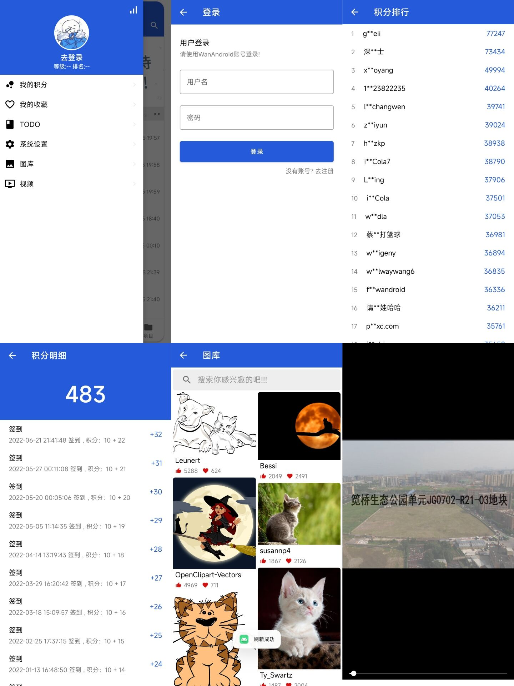

# WanAndroid项目实战

## 介绍

这个是半年前写的项目,主要就实现了首页以及首页侧滑栏,添加了图库和视频功能。

API是使用鸿洋大佬的,地址:https://www.wanandroid.com

## 目的

目的是为了学习:Lottie、加载框、WebView、加载时显示骨架、保存图片以及ViewPager2播放视频

## UI

## 特点

* 使用 OkHttp + Handler 完成网络请求
* 封装了加载框

## 联系我

* QQ：2928527233
* CSDN：https://blog.csdn.net/weixin_51298509
